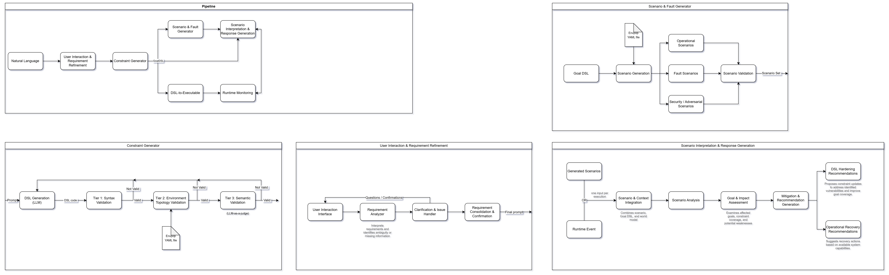

# Cyber-Physical Systems Verification Framework

An end-to-end research framework for translating natural language requirements into formally verified operational constraints, synthesizing test scenarios, and conducting runtime monitoring for Cyber-Physical Systems (CPS) and smart environments.

---

## 1. Overview & Research Scope

In safety-critical Cyber-Physical Systems, ensuring that runtime behaviors conform to formal operational constraints is vital. However, manually engineering formal specifications using Domain-Specific Languages (DSLs) requires deep domain expertise and is prone to human error.

This framework implements an automated, multi-stage LLM pipeline that:

1. **Refines raw, ambiguous natural language requirements** into structured operational intents.
2. **Synthesizes declarative Goal-DSL models** using Large Language Models coupled with a deterministic, **multi-tier self-repair verification loop** (syntax checking, 2D physical world topology validation, and domain semantic checking).
3. **Generates operational scenarios and fault injection cases** to stress-test system dynamics.
4. **Interprets faults and generates automated mitigations/responses** when constraints are violated.
5. **Performs real-time execution monitoring** against formalized constraints over message brokers (e.g., Redis, MQTT).

---

## 2. End-to-End Architecture



### Verification Loop Breakdown (Stage 2)

* **Tier 1 (Grammar & Syntax):** Deterministically compiles the synthesized model against the formal `goaldsl` metamodel using the textX compiler (`goaldsl validate`). Any parsing or grammar errors return exact line and token diagnostics.
* **Tier 2 (Physical Grounding):** Cross-references declared entities, sensors, actuators, coordinate POIs, and properties against an `EnvPop` 2D simulation world model (`world_model.yaml`). Hallucinated or misnamed hardware components are rejected deterministically without invoking additional LLMs.
* **Tier 3 (Semantic Feasibility):** Evaluates whether the generated logic physically and logically satisfies the original prompt requirements (e.g., sensible threshold directions, correct spatial coordinates, domain-valid timing) via an LLM Semantic Judge.

---

## 3. Repository Structure

```text
thesis-cps-framework/
├── data/                          # Data assets and generated files
│   ├── prompts/                   # Natural-language input prompts
│   ├── references/                # Canonical Goal-DSL reference files
│   ├── scenarios/                 # Generated scenario traces and SmAuto files
│   └── world_models/              # EnvPop 2D world models and floorplans
├── experiments/                   # Evaluation results and benchmarking
│   ├── artifacts/                 # Serialized experiment runs and logs
│   └── eval_results.csv           # Verification/evaluation results
├── external/                      # External dependencies
│   └── goal-dsl/                  # Goal-DSL metamodel, grammar and compiler
├── src/                           # Source code
│   ├── 1_requirement_refinement/  # Stage 1: NL parsing and requirement refinement
│   ├── 2_constraint_generator/    # Stage 2: Goal-DSL generation and verification
│   ├── 3_scenario_generator/      # Stage 3: Scenario generation and fault injection
│   ├── 4_response_generation/     # Stage 4: Fault interpretation and response generation
│   ├── 5_runtime_monitoring/      # Stage 5: Runtime monitoring
│   └── common/                    # Shared infrastructure and configuration
├── .gitignore
├── requirements.txt
└── README.md

```

---

## 4. Technology Stack & Key Dependencies

| Technology | Role |
| --- | --- |
| **Python 3.11+ / 3.14** | Core execution runtime. |
| **Goal-DSL (`goaldsl`)** | External Domain-Specific Language developed in textX for runtime behavior verification of CPS and IoT systems. Supports sensors, actuators, hybrid entities, condition goals, area goals, and composite goals. |
| **EnvPop** | 2D world modeling and simulation specification language defining spatial geometries, rooms, POIs, sensors, effectors, and broker transports. |
| **OpenRouter API** | Unified gateway for LLM inference (generation and semantic evaluation). |
| **python-dotenv** | Zero-leak environment variable loading for API secrets. |

---

## 5. Installation & Setup

### Prerequisites

* Python 3.11 or newer (Python 3.14 supported).
* Git.

### 1. Clone the Repository and Submodules

```bash
git clone https://github.com/NakoPCH/thesis-cps-framework.git
cd thesis-cps-framework

```

If `external/goal-dsl` is configured as a Git submodule:

```bash
git submodule update --init --recursive

```

### 2. Set Up Virtual Environment

```bash
# Windows (PowerShell)
python -m venv .venv
.\.venv\Scripts\Activate.ps1

# Linux / macOS
python3 -m venv .venv
source .venv/bin/activate

```

### 3. Install Python Dependencies

```bash
pip install --upgrade pip
pip install -r requirements.txt

```

Ensure `goaldsl` is installed in editable mode from the external submodule:

```bash
pip install -e external/goal-dsl

```

Verify the installation by running:

```bash
goaldsl --help

```

### 4. Configure Environment Variables

Create a `.env` file in the repository root:

```env
OPENROUTER_API_TOKEN=your_openrouter_api_key_here

```

---

## 6. Execution & Verification

### Running the Constraint Verification Loop (Stage 2)

The verification loop queries the configured LLM, attempts textX grammar compilation, verifies physical grounding against an EnvPop world model, and conducts semantic validation.

```bash
python src/2_constraint_generator/verification_loop.py

```

### Experiment Output & Benchmark Logs

* **Generated Goal DSL:** Successful models are written to `data/llm_created_file.goal`. Models failing all retry attempts are preserved in `data/failed_output.goal`.
* **Execution Audit Log:** Every attempt across all runs is appended to `experiments/eval_results.csv` with the following schema:
`Run_ID`, `Timestamp`, `Model`, `Attempt`, `Max_Retries`, `Status`, `Active_Tiers`, `Failed_Tier`, `Error_Line_No`, `Error_Code_Line`, `Error_Message`.

---

## 7. Configuration (`src/common/config.py`)

All global directories, model selections, and operational flags are centralized in `src/common/config.py`:

```python
# Model Configurations
MODEL = "liquid/lfm-2.5-2.6b:free"   # Generator model
JUDGE_MODEL = MODEL                  # Tier 3 Evaluator model

# Tier Execution Toggles
ENABLE_TIER_1 = True   # textX syntax compiler check
ENABLE_TIER_2 = True   # EnvPop deterministic physical grounding check
ENABLE_TIER_3 = True   # LLM semantic feasibility check
MAX_RETRIES = 3        # Maximum self-repair feedback iterations

```

---

## 8. Guidelines for AI Coding Agents

When modifying this repository or implementing subsequent pipeline stages:

1. **Path Resolution:** Never hardcode absolute or local relative filesystem paths. Always import paths from `src/common/config.py` (`DATA_DIR`, `EXPERIMENTS_DIR`, `WORLD_MODELS_DIR`, `REFERENCE_DIR`, etc.).
2. **Artifact Isolation:** Source folders (`src/`) must remain clean. Output logs belong in `experiments/`, and generated models belong in `data/`.
3. **Module Imports:** Add standard package markers (`__init__.py`) to new subdirectories under `src/`. For cross-module imports, resolve relative to the project root or append `src/` via `sys.path`.
4. **Deterministic Validation First:** Before invoking costly LLM evaluations, prioritize deterministic checks (grammar validation via `goaldsl validate`, schema validation, AST parsing, and world model consistency).
5. **Data Preservation:** Benchmark metrics must always append cleanly to `experiments/eval_results.csv` without overwriting existing evaluation histories.